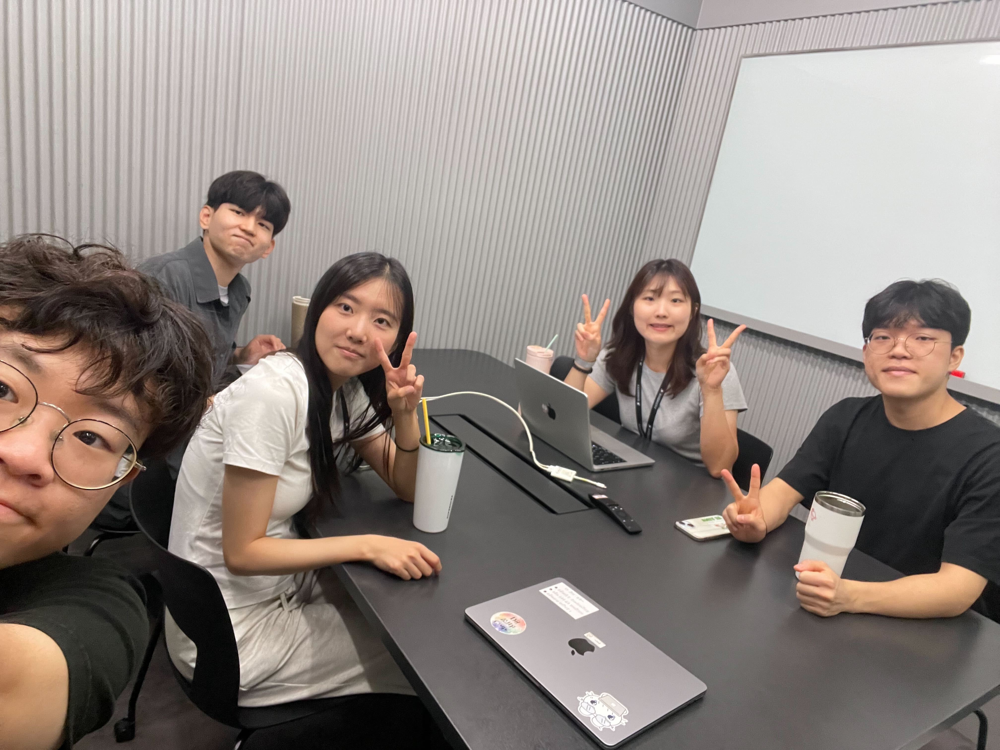

## 📅 2025-07-10

### **오늘의 주제**

코드 컨벤션

### **오늘의 피드백**

### 레오
* **시작과 진행**: 대화의 시작을 열고 다음 발언자를 지목하는 등 **대화 흐름을 잘 주도**했습니다.
* **구체적인 예시**: `create controller`나 `service` 같은 **구체적인 예시를 들어 설명**하려는 노력이 좋았습니다.
* **문법 개선 필요**: 동사 시제, 단수/복수 일치 등 기본적인 문법 오류가 있어 전달력을 높이려면 **문법적 정확성을 더 높이는 연습**이 필요합니다.

---
### 포라
* **핵심 아이디어 전달**: `snake_case`, `final keyword` 사용 여부 등 **핵심 컨벤션을 명확히 제시**했습니다.
* **구조 개선 필요**: 문장이 다소 길고 복잡하게 이어지는 경향이 있어, **더 짧고 간결한 문장으로 분리**하면 이해하기 쉬울 거예요.
* **어순 및 표현**: 한국어식 어순이나 표현이 영어 문장에 그대로 반영되는 경우가 있어 **자연스러운 영어 표현 익히기**가 중요합니다.

---
### 멍구
* **명확한 규칙 제시**: `comments`나 `parameter rules`처럼 **규칙을 명확하게 설명**했습니다.
* **정보 제공**: `MySQL` 사용이나 `NoSQL` 고려 등 **팀의 결정을 잘 공유**했습니다.
* **정확한 용어 사용**: `CS logic` 보다는 `computer science logic` 또는 `technical logic`으로 풀어서 설명하는 것이 더 명확할 수 있습니다. **전문 용어 사용에 유의**해 주세요.

---
### 밍곰
* **구체적인 구조 설명**: 패키지 구조, 어노테이션 순서 등 **상세한 내용을 잘 설명**했습니다.
* **질문에 대한 응답**: `CQRS` 채택 배경처럼 질문에 **성실하게 답변하려는 태도**가 좋았습니다.
* **문장 연결**: 문장과 문장 사이의 연결이 매끄럽지 않은 부분이 있어, **접속사나 연결어를 활용하여 자연스럽게 이어주는 연습**이 필요합니다.

---
### ?멍구
* **핵심 원칙 강조**: `side effects`나 `naming`처럼 **핵심 원칙을 강조**하는 점이 좋았습니다.
* **정확한 표현 추구**: `line jung kit lengths`를 `line lengths`로 바로잡는 것처럼 **정확한 표현을 사용하려는 노력**이 돋보였습니다.
* **간결성**: 때때로 단어 선택이나 문장 구조를 **더 간결하게 다듬으면 메시지 전달이 더 효과적**일 것입니다.

### **오늘의 사진**
