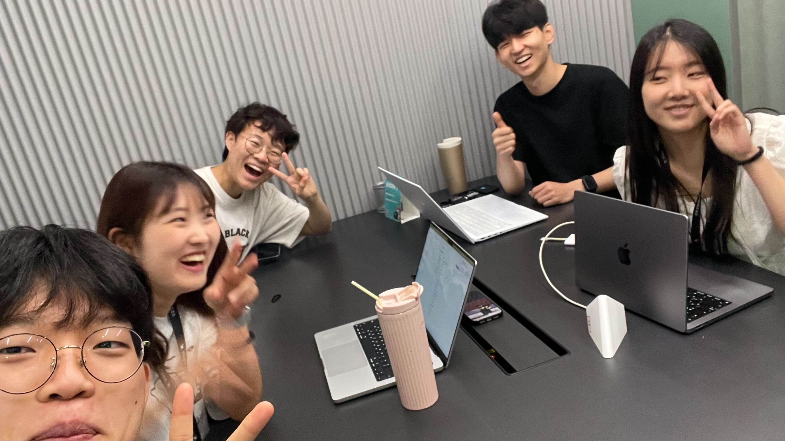

## 📅 2025-07-11

### **오늘의 주제**

여행하고 싶은 나라

### **오늘의 피드백**

🧑‍🎤 멍구

•	“I want to go to Japan because…” 식으로 이유를 덧붙이는 설명이 자연스러움
•	완전한 문장 구조 사용 가능 (주어 + 동사 + 목적어)
•	“rare sights with my own eyes” 같이 다소 부자연스러운 표현도 있지만 이해에는 지장 없음
•	비교/이유 등 논리적 연결어(because, compared to) 잘 활용
•	문장 간 흐름 개선 필요 (같은 표현 반복됨)

⸻

🌟 포라

•	“Oh, that’s so good!” 등 감정 표현에 능숙
•	상대방의 말에 동의하거나 반응하는 말이 주를 이룸
•	자기 의견이나 설명이 부족함
•	어휘는 단순하지만 문법 실수는 거의 없음
•	더 구체적인 문장 연습 필요 (예: 여행 경험, 이유 설명 등)

⸻

✈️ 제프리

•	“I have experience visiting…” 등으로 과거 경험을 구체적으로 설명
•	접속사 활용이 능숙 (because, also, and)
•	여러 나라 언급하며 내용 전개 능력 뛰어남
•	자연스러운 표현력 보유 (“suits my taste”, “game centers are fun”)
•	반복 표현 (“Japan is the best”)은 다양한 어휘로 대체 필요

⸻

😅 밍곰

•	“We are Japan’s country?”, “Don’t kill(?)” → 문법 및 의미 전달에 혼란 있음
•	말하고자 하는 의도는 보이지만 표현 방법이 어색
•	단어 선택이 잘못되거나 불분명함
•	주어-동사-목적어 구조 훈련 필요
•	자기 생각을 말하려는 시도는 긍정적, 표현만 개선되면 큰 발전 가능

⸻

🎬 레오

•	영화, 장소 등 문화 콘텐츠를 활용한 설명이 풍부
•	“Eternal Sunshine”, “Montauk” 같은 맥락 제공이 인상적
•	표현 도중 끊기는 부분 있음 (“swimming po…” → pool)
•	개인의 감정 + 배경정보 연결 능력이 좋음
•	문장 간 논리 흐름은 더 자연스럽게 정리할 필요 있음

### **오늘의 사진**
