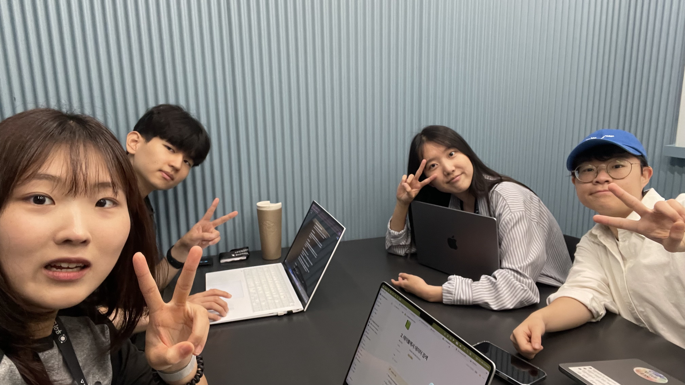

## 📅 2025-07-17

### **오늘의 주제**

스몰톡 + 우테코 프젝 목표

### **오늘의 피드백**

- shallow - 얕은
  - ex) Do you have a shallow interest in baseball? - 야구에 얕은 흥미가 있나요?
- debate - 토론
- capacity - 가용성
  - ex) high-capacity traffic - 대용량 트래픽
- conviction - 확신
  - ex) I'm not sure. - 잘 모르겠다 (가장 기본적인 표현)
    - ex) I'm not certain. - 확신이 없다 (조금 더 격식있는 표현)
- "두 마리 토끼를 다 잡을 수 없다" - You can't have your cake and eat it too.

### ✅ 표현 1
**원문**:
> *We use our experience we*
> *baseball fan to goal with our team.*
**개선 표현**:
> *We used our experience as baseball fans to align with our team’s goal.*
**설명**:
* “to goal with”는 영어에 없는 표현입니다. → “align with a goal” 또는 “work toward a goal” 등으로 표현합니다.
* 영어 화자는 **동사의 정확한 목적어 사용과 전치사 구문을 중요시**합니다.
* “as baseball fans”는 **정체성을 나타낼 때 사용하는 전형적 표현**입니다.
---
### ✅ 표현 2
**원문**:
> *I am very refusal. No no I am very thanks to invite LG and KT it is import*
**개선 표현**:
> *I really appreciate the invitation to LG and KT. It’s important to me.*
**설명**:
* “I am very refusal”은 문법적으로도 의미상으로도 어색합니다. “refusal”은 명사이며, 감정을 표현할 때 쓰지 않습니다.
* 영어 화자는 \*\*감사 표현 시 “I appreciate” 또는 “I’m grateful for”\*\*를 자주 사용하며, 그 뒤에 **정확한 목적 대상**이 와야 자연스럽습니다.
---
### ✅ 표현 3
**원문**:
> *it's our belief that our team didn't any trouble each other.*
**개선 표현**:
> *We believe our team worked well without any conflicts.*
**설명**:
* “didn’t any trouble each other”는 어순과 구조가 틀렸습니다.
* 영어 화자는 **부정문에서도 ‘do not + 동사원형’의 기본 구조를 유지**하고, **trouble someone** 대신 “have conflict”나 “cause problems” 등의 구체적인 동사를 선호합니다.
---
### ✅ 표현 4
**원문**:
> *this situation is repeat*
**개선 표현**:
> *This situation keeps repeating.*
> or
> *This situation is happening again and again.*
**설명**:
* “is repeat”는 **동사의 시제와 형태가 잘못된 표현**입니다. 반복되는 상황을 나타낼 때는 “keeps \~ing”나 “happens repeatedly” 등을 사용합니다.
* 영어 화자는 **상태를 묘사할 때는 현재진행형 또는 빈도 표현**을 사용해 자연스럽게 전달합니다.
---
### ✅ 표현 5
**원문**:
> *large capacity traffic so I want to experience that trouble shooting about this problem.*
**개선 표현**:
> *I want to gain experience in troubleshooting high-traffic systems.*
**설명**:
* “that troubleshooting about this problem”은 어색한 중복 표현입니다.
* 원어민은 **동사를 명확하게 목적에 맞게 사용하며**, 분야에 대한 경험을 말할 때는 “gain experience in \~” 같은 표현을 사용합니다.
---
### ✅ 표현 6
**원문**:
> *we can't catch two rabbit, three rabbit or gathering users and technology experience and team project experience.*
**개선 표현**:
> *We can't chase two or three rabbits — like user acquisition, technical experience, and team collaboration — all at once.*
**설명**:
* “catch two rabbit”은 한국어의 속담 “두 마리 토끼를 잡을 수 없다”를 영어식으로 옮긴 표현이지만, 영어 속담은 \*\*“You can’t chase two rabbits at once”\*\*입니다.
* 영어 화자는 **은유나 속담을 사용할 때도 익숙한 표현이나 원어 사용을 중시**합니다.
---
### ✅ 표현 7
**원문**:
> *Have your cake and you need to what*
**개선 표현**:
> *You can’t have your cake and eat it too.*
**설명**:
* 이는 **고정된 영어 속담 표현**입니다. 의미는 “두 가지 모두 가질 수 없다”는 뜻으로, 위의 ‘두 마리 토끼’와 같은 맥락에서 자주 사용됩니다.
* 영어 화자들은 **속담은 반드시 원형 그대로 사용할 것**을 기대합니다.
---
### ✅ 표현 8
**원문**:
> *The fate is important for me.*
**개선 표현**:
> *Fate is important to me.*
> or
> *I believe fate plays an important role in my life.*
**설명**:
* 영어에서는 “the fate”보다는 **“fate”를 관사 없이 일반 명사로 사용**합니다.
* “important for me”보다는 \*\*“important to me”\*\*가 감정·가치와 연결할 때 자연스럽습니다

### **오늘의 사진**

