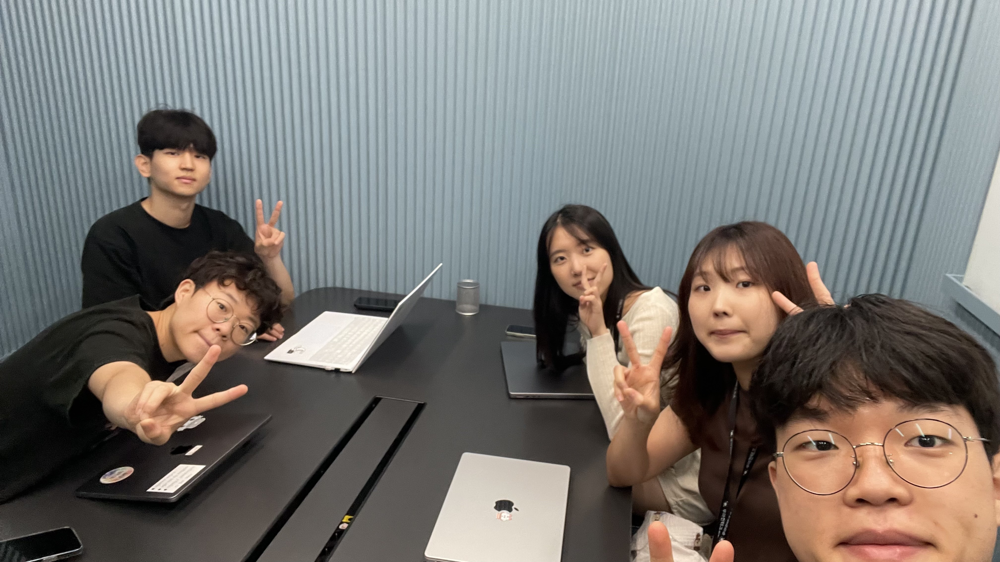

## 📅 2025-07-18

### **오늘의 주제**

스트레스 해소법

### **오늘의 피드백**

- sick of it - 질린다
- be stressed - 스트레스 받다
  - ex) I'm stressed out. - 스트레스 받다
  - ex) I'm totally stressed out. - 나 완전 스트레스 받아
- be overwhelmed - 벅차다
  - ex) I'm overwhelmed. - 벅차
- progress - 진행상황
- 일주일 안에
  - in a week - 대략적인 7일 느낌 (정확한 대응)
  - within a week / by the end of the week - 자주 쓰이는 표현
  - salted shirmp - 새우젓
- 질렸어
  - I'm sick of this. / I'm so over this. - 이거에 질렸어 (음식에 대해서도 물리다는 표현으로 쓸 수 있을듯)
- 이해할 수 없어
  - I don't get it. - 왜 그렇게 생각하는지 모르겠어 (이해 불가)
  - I can't really feel the same. - 나한테는 와닿지 않아 (감정적 동의 불가)
  - I see your point, but I don't really feel the same. - 상대를 존중하면서 공감하지 않는 표현

### ✅ **1. 원문**
> "I am tired because I sleep late."
### ❌ 문제점
* 시제 불일치: “I am tired”는 현재형이고 “I sleep late”는 일반 현재형인데, 늦게 잤다는 과거 사실을 말하고 있음.
* 일반적으로는 **과거형(slept)** 또는 \*\*현재완료(have slept)\*\*를 써야 자연스럽다.
### ✅ 개선 표현
> "I’m tired because I slept late last night."
> 또는
> "I’m feeling tired today because I didn’t get enough sleep."

### 💡 영어 사고방식

원어민은 “late sleeping”을 하나의 습관이 아닌, **전날 밤의 구체적인 사건**으로 인식합니다. 그래서 “slept late”처럼 과거 시점을 분명히 해야 자연스럽습니다.

---
### ✅ **2. 원문**
> "I can't choice."
### ❌ 문제점
* “choice”는 **명사**이고, 여기서는 **동사 choose**를 써야 함
* “I can’t choose”가 맞는 표현
### ✅ 개선 표현
> "I can’t choose."
> "It’s hard for me to decide."
### 💡 영어 사고방식
원어민은 “choice”와 “choose”를 명확히 구분합니다. ‘결정하지 못하겠다’는 상황에서는 **동작을 나타내는 동사 choose**를 사용합니다.
또한 원어민은 “I can’t choose”보다 “It’s hard to decide”처럼 **감정을 설명하는 방식**을 자주 씁니다.
---
### ✅ **3. 원문**
> "My REM is dying."
### ❌ 문제점
* “REM is dying”이라는 표현은 다소 과장되거나 의미가 불명확함. (REM sleep은 죽을 수 없음)
* 듣는 이가 의미를 이해하기 어렵고, 면접에서는 부적절할 수 있음
### ✅ 개선 표현
> "I didn’t get enough REM sleep, so I feel exhausted."
> 또는
> "I feel like I didn’t get any deep sleep."
### 💡 영어 사고방식
의학적 개념(REM sleep)은 실제로 많이 쓰이지만, \*\*“REM is dying”\*\*은 말장난처럼 들릴 수 있습니다.
면접 상황에서는 좀 더 명확하고 논리적인 표현이 신뢰를 줍니다.
---
### ✅ **4. 원문**
> "Let me talk about threats."
### ❌ 문제점
* “threats”는 “위협”이란 뜻으로, 여기서는 \*\*“stress” 또는 “stressful situations”\*\*을 말하려는 것으로 추정됨
* ‘위협’은 면접에서 무거운 단어라 오해를 살 수 있음
### ✅ 개선 표현
> "Let me talk about how I deal with stress."
> "Let me share how I manage stress in difficult situations."
### 💡 영어 사고방식
“Threats”는 공격, 위험 요소 같은 **외부의 적대적 상황**을 의미하므로, 단순히 스트레스에 대한 이야기를 할 때는 어울리지 않습니다.
면접에서는 **내면의 감정 조절**을 강조하는 표현이 더 신뢰를 줍니다.
---
### ✅ **5. 원문**
> "Oh Actually I accept the stress my well except my body."
### ❌ 문제점
* 문장 구조 혼란: “accept the stress my well” → 문법적으로도 구조적으로도 부자연스러움
* 의미 전달이 모호함
### ✅ 개선 표현
> "I usually handle stress well, but my body still feels the effects."
> 또는
> "Mentally, I’m okay with stress, but my body reacts strongly."
### 💡 영어 사고방식
영어에서는 **정신과 육체를 분리하여 표현**하는 경우가 많습니다. 예를 들어, “I’m fine mentally, but physically I feel it”처럼.
그래서 “except my body”보다는 \*\*“my body still reacts”\*\*처럼 동사를 사용하는 방식이 자연스럽습니다.
---
### ✅ **6. 원문**
> "Our favorite food is a little different than sol food."
### ❌ 문제점
* “sol food”는 오타로 보이며 아마 “soul food”를 말하고자 한 듯
* “different than” → 대부분의 경우 \*\*“different from”\*\*이 더 자연스러움
### ✅ 개선 표현
> "Our favorite food is a little different from soul food."
또는 맥락을 확장해서
> "My favorite food isn’t exactly soul food. For me, soul food is something I eat when I feel really down."
### 💡 영어 사고방식
\*\*“Soul food”\*\*는 미국 흑인 문화에서 유래된 음식이지만, 최근에는 **정서적 위로를 주는 음식**이라는 뜻으로 널리 쓰입니다.
“different from”이 전통적인 문법 규칙상 더 권장되며, “different than”은 일부 지역(특히 미국)에서만 비격식적으로 사용됩니다.

### **오늘의 사진**

